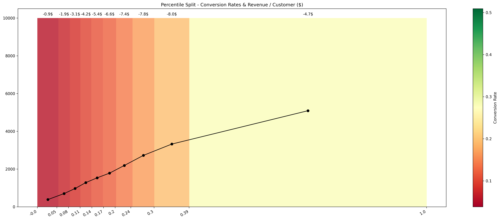

# Optimization-Based Customer Segmentation

This repository provides an optimization-based segmentation tool for business intelligence, enabling data-driven segmentation of customers for targeted marketing efforts. The algorithm uses customer propensities (predicted probabilities of an event) and historical data (actual outcomes) to optimize the segmentation process, maximizing expected revenue while accounting for costs and penalties. This dynamic approach leads to more effective and fine-tuned segments compared to naive or percentile-based methods.

## Key Features
- **Optimized Segmentation**: The algorithm dynamically adjusts segmentation boundaries to maximize expected revenue, based on conversion rates and customer acquisition costs.
- **Customizable Functions**: Users can define their own revenue and cost functions depending on business needs.
- **Adaptable to Different Data**: The tool adapts to the actual distribution of customer propensities and conversion behaviors, ensuring resource allocation to the most promising segments.
- **Merge Small Bins**: Automatically merges bins that don't meet a minimum sample size, leading to more robust segmentation.
  
This segmentation tool is particularly useful for business intelligence teams seeking to enhance the return on investment (ROI) for marketing campaigns by focusing on high-value segments.

## Advantages of Optimization Algorithm Segmentation

### 1. **Higher Conversion Rates in Key Segments**
   - The algorithm identifies high-potential segments with significantly higher conversion rates. It balances conversion rates effectively across segments, unlike naive or percentile methods that might overlook smaller but valuable segments.

### 2. **Fine-Grained Segmentation**
   - Provides finely tuned segments based on customer behavior, enabling more precise and dynamic targeting. This allows for personalized marketing strategies that can adapt to changing customer behavior.

### 3. **Dynamic Response to Customer Behavior**
   - The algorithm adapts to the actual distribution of customer propensities and conversion behaviors. It adjusts in real-time, unlike fixed-interval methods which may misrepresent certain customer groups.

### 4. **Mitigation of Underperformance in Small Bins**
   - Bins with insufficient samples are automatically merged, ensuring that small bins don’t distort insights or lead to poor resource allocation in marketing campaigns.

### 5. **Holistic Revenue Consideration**
   - The algorithm factors in both conversion rates and acquisition costs, aiming to maximize net revenue rather than focusing solely on conversion rates.

### 6. **Strategic Focus on High-Value Segments**
   - By optimizing segmentation based on expected revenue, businesses can prioritize high-value customer segments, leading to improved marketing ROI and a strategic focus on growth areas.

## Installation

You can install the package from the PyPI repository
    
```bash
pip install smart-segment
```

## Usage

This example shows how to use the `find_optimal_bins` function to find the optimal segmentation for a marketing campaign:

```python
import numpy as np
import pandas as pd
from smart_segment.segmentation import find_optimal_bins

# Example data (Simulating imbalanced data with a Gamma distribution)
dists = np.random.gamma(2, 2, 100_000)
data = {'propensity': np.sort(np.clip(dists, 0, 20)/20.0),
        'y': np.random.choice([0, 1], 100_000)}

df = pd.DataFrame(data)

# Constant revenue, with varying cost (depending on propensity)
revenue_fn = lambda ix: 30
cost_fn = lambda ix: 2 * ix

# Find optimal bins with custom revenue and cost functions
result = find_optimal_bins(df['propensity'], df['y'], n_bins=10, 
                        revenue_fn=revenue_fn,
                        cost_fn=cost_fn,
                        min_samples=10, global_search=True)
best_n_bins, best_cutoffs, max_revenue = result

# Apply the segmentation to the DataFrame
df['optim_global'] = pd.cut(df['propensity'], best_cutoffs, include_lowest=False, duplicates='drop')

print(f"Best number of bins: {best_n_bins}")
print(f"Best cutoffs: {best_cutoffs}")
print(f"Maximum Revenue: {max_revenue}")
```

## Performance

Tests were conducted to compare the performance of various customer segmentation strategies using the generated propensity groups. 

**NOTE**: The Optimized Global split is used here, as the quantile-based method is identical to the Percentile split.

### Key Statistics

Here are some key statistics comparing the methods with the graphical and aggregate analysis:

| Statistic                                  | Uniform         | Percentile      | Optimized        |
|--------------------------------------------|------------------|-----------------|------------------|
| Overall Conversion Rate                    | 19.98 %          | 19.98 %         | 19.98 %          |
| Lowest Conversion Rate (Value)             | 6.3%           | 3.8%         | 9.1%          |
| Lowest Conversion Rate (# Customers)       | 1673             | 383             | 4154             |
| Best Conversion Rate (Value)               | 0.97479%         | 0.5092%         | 1.0000%          |
| Best Conversion Rate (# Customers)         | 116              | 5092            | 63               |
| Total Revenue                              | -$18,146         | -$460,070       | $172,844         |
| Worst Total Revenue Group                  | $-9,243 (Group 9)| $-8,028 (Group 8)| $-4,724 (Group 9)|
| Best Total Revenue Group                   | $9,243 (Group 9) | $-4,724 (Group 9)| $15,230 (Group 6)|
| Average Cost / Customer                    | -$0.165          | -$4.6007        | $1,577.85        |
| Average Revenue / Customer                 | -$0.104965       | -$4.6007        | $1,577.85        |

The Optimized model significantly outperforms both the Uniform and Percentile methods across all key metrics, particularly in overall conversion rates and total revenue. These improvements underscore the effectiveness of the optimized segmentation approach in identifying and targeting high-value customers.

Granular statistics across bands for each of the strategies can be found in the `examples` directory.

The conversion rates are represented through the following visualizations:
- **Bar Chart**: Displays the number of customers in each segment.
- **Line Chart**: Shows the corresponding number of conversions for each segment.
- **Color Scale**: Illustrates the conversion rate across the different bands.

Additionally, the **Revenue per Customer** is indicated above each bar in the bar chart, providing a clear view of the economic impact of each segment.


*Uniform Segmentation Results*


*Percentile Segmentation Results*


*Optimized Segmentation Results*


This method results in a more effective targeting strategy, enabling businesses to maximize their revenue potential while ensuring that high-value customers are efficiently identified. By balancing customer volume with targeted conversion rates, the optimized approach surpasses traditional methods, yielding superior results in both overall conversions and revenue generation.

## Repository

The repository is available on Github if you would like to install the latest version of the code.

### Structure

The repository is organized as follows:

```bash
├── smart_segment
│   ├── segmentation.py          # Main logic for customer segmentation
│   ├── optimization.py          # Optimization methods for determining cutoffs
│   └── utils.py                 # Utility functions for revenue calculation and bin merging
├── tests
│   ├── test_segmentation.py     # Unit tests for the segmentation logic
│   ├── test_optimization.py     # Unit tests for the optimization methods
│   └── test_utils.py            # Unit tests for utility functions
├── examples
│   ├── Example.html             # HTML representation of a Jupyter notebook example
│   ├── segments.csv             # Sample results across various segmentation methods
│   ├── analyses
│   │   ├── uniform_plot.png     # Conversion plot for Uniform splits
│   │   ├── uniform_stats.csv    # Conversion statistics for Uniform splits
│   │   ├── percentile_plot.png  # Conversion plot for Percentile splits
│   │   ├── percentile_stats.csv # Conversion statistics for Percentile splits
│   │   ├── optimized_plot.png   # Conversion plot for Optimized splits
│   │   └── optimized_stats.csv  # Conversion statistics for Optimized splits
├── requirements.txt             # List of required Python packages
├── setup.py                     # Installation script for the package
└── README.md                    # Documentation file for the package
```

**NOTE**: The plots here are for the Global optimization function. The Quantile based optimization is not included as it is identifical to the Percentile split with the same number of bins.

### Installation

1. Clone this repository to your local machine:
   ```bash
   git clone https://github.com/astronights/smart-segment.git
   cd smart-segment
   ```

2. Install the required dependencies:
    ```bash
    pip install -r requirements.txt
    ```

3. To install the package in your Python environment:
    ```bash
    pip install .
    ```

### Running Tests

To ensure that everything works as expected, you can run the test suite using `pytest`:

1. Install pytest if you don't have it already:

    ```
    pip install pytest
    ```

2. Run the tests:

    ```bash
    pytest
    ```

This will execute the test files located in the tests directory and validate that the segmentation tool is functioning correctly.

## License

This project is licensed under the MIT License. You are free to use, modify, and distribute this software as long as the terms of the license are met. For more information, see the LICENSE file.

## Contributions
Contributions are welcome! If you have ideas for improvements or find any issues, please feel free to open an issue or submit a pull request. Community contributions are encouraged to help make this tool even better.